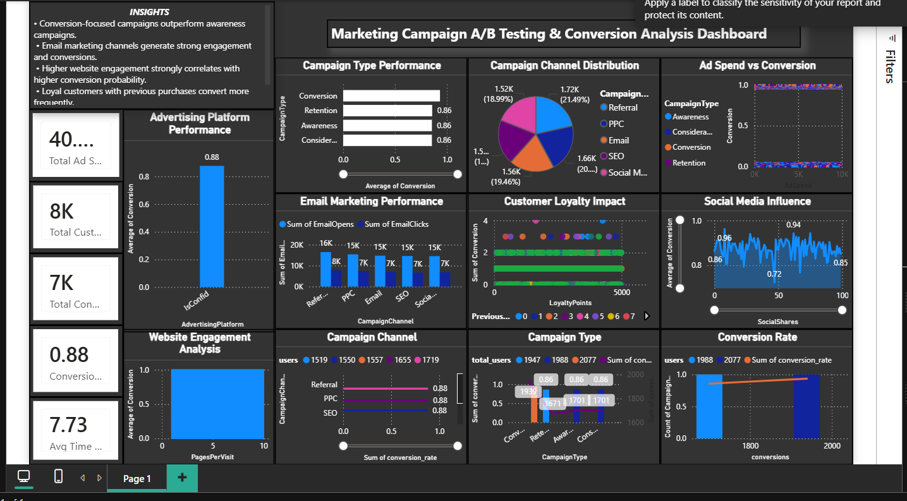

##### Marketing Campaign A/B Testing \& Conversion Analysis

###### Problem Statement

Businesses invest heavily in marketing campaigns but often struggle to identify which campaign types and channels drive the highest conversions.

This project analyzes campaign performance to optimize marketing strategy and improve conversion rates.

###### Dataset

**The dataset contains marketing campaign data including:**

* Campaign Type (Awareness, Conversion, Retention, Consideration)
* Campaign Channel (Email, Social Media, PPC, SEO, Referral)
* Customer behavior (clicks, opens, loyalty points)
* Conversion metrics

###### Tools \& Technologies

* Python (Pandas, NumPy)
* Data Visualization (Seaborn, Matplotlib)
* Dashboarding (Power BI / similar tool)
* Statistical Analysis (A/B Testing concepts)

###### Project Workflow

**1.Data Cleaning \& Preprocessing**

* Handled missing values
* Standardized column names
* Removed duplicates

**2.Feature Engineering**

* Derived engagement metrics
* Created conversion-related KPIs

**3.Analysis**

* Campaign-wise conversion analysis
* Channel performance comparison
* Customer behavior analysis

**4.Visualization**

* Built an interactive dashboard to track performance
* Compared multiple campaign strategies

###### Key Insights (From Dashboard)

**Campaign Performance**

* Conversion-focused campaigns outperform awareness campaigns
* Retention and consideration campaigns show stable but lower conversion impact

**Channel Effectiveness**

* Email marketing drives strong engagement and conversions
* PPC and Referral channels also contribute significantly
* Social media shows moderate but consistent performance

**Advertising Platform Impact**

* High-performing platforms achieve \~0.88 average conversion rate
* Platform selection plays a critical role in campaign success

**Customer Behavior Insights**

* Customers with higher loyalty points convert more frequently
* Returning users show significantly better conversion probability

**Website Engagement**

* Higher pages per visit strongly correlates with higher conversions
* Average engagement time (\~7.7 units) indicates strong user interaction

**Conversion Trends**

* Overall conversion rate remains high (\~0.88)
* Campaign channels show relatively balanced distribution
* Engagement-driven campaigns yield better ROI

###### **Business Impact**

* Helps businesses identify high-performing campaign strategies
* Optimizes marketing spend by focusing on conversion-driven channels
* Improves ROI through data-driven decision making
* Enhances customer targeting using behavioral insights

###### **How to Run**

pip install -r requirements.txt

python main.py

## 📸 Dashboard Preview

---

## 🎥 Demo Video

[Watch Demo](ab_testing.mp4)

###### **Future Improvements**

* Implement predictive modeling for conversion forecasting
* Add real-time dashboard integration
* Perform deeper A/B statistical testing
* Integrate customer segmentation

###### **Author** 

Thiviyesh K
Aspiring Data Analyst

